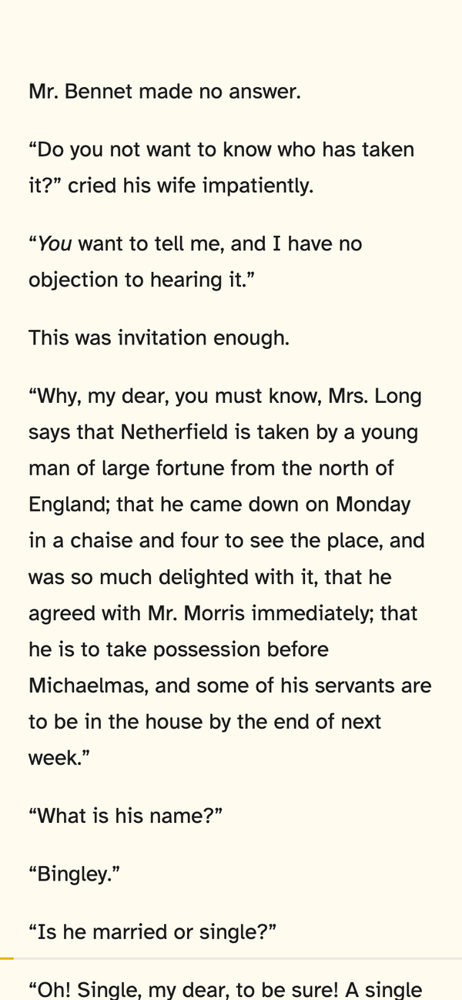
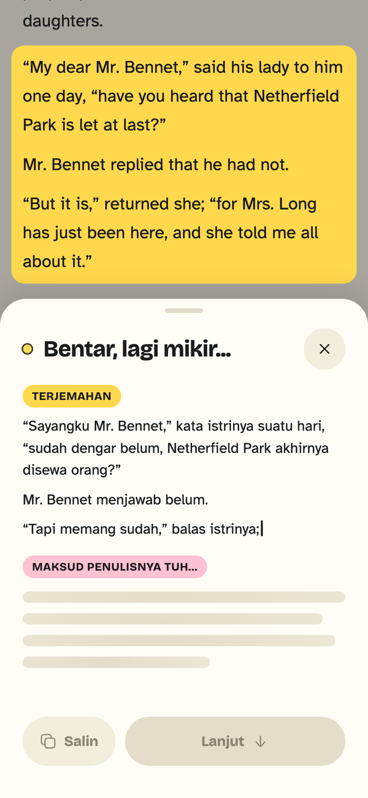
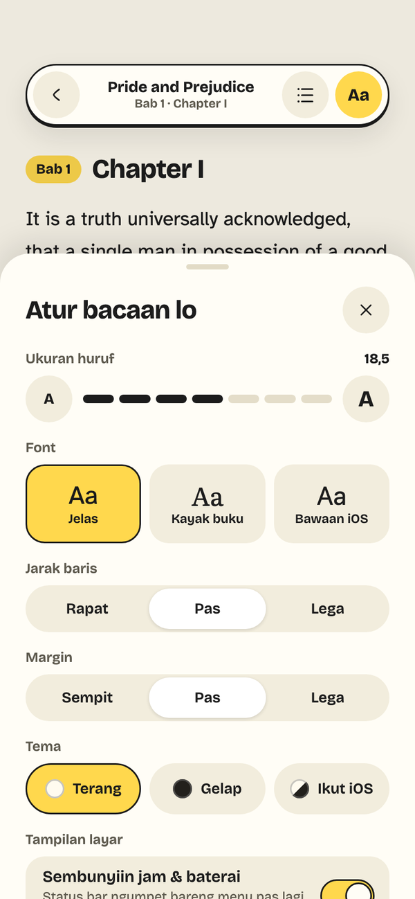
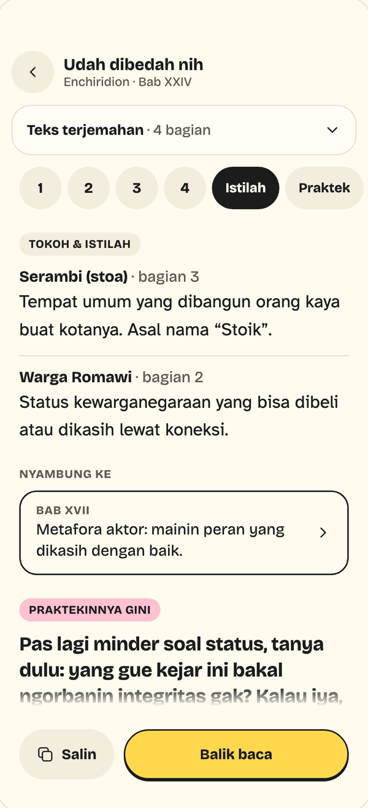
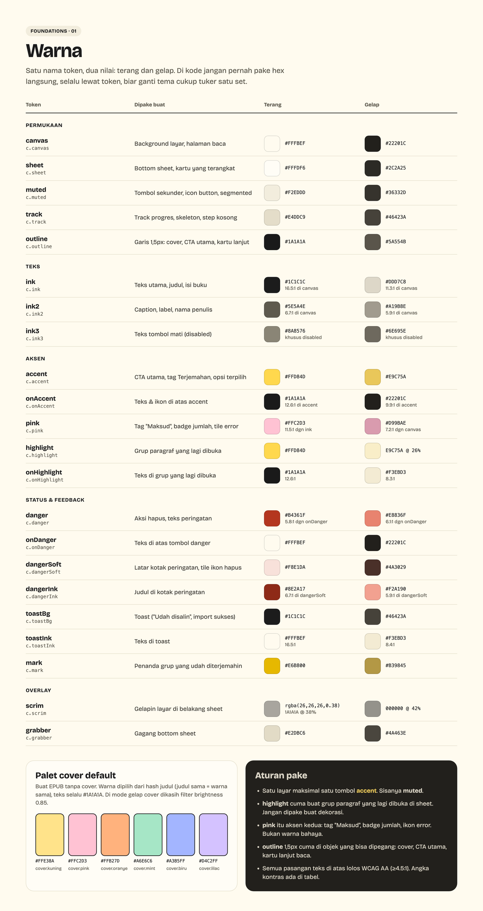
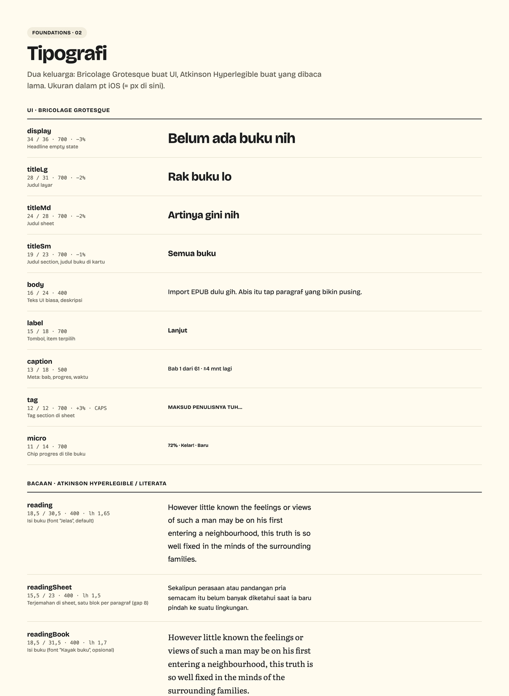
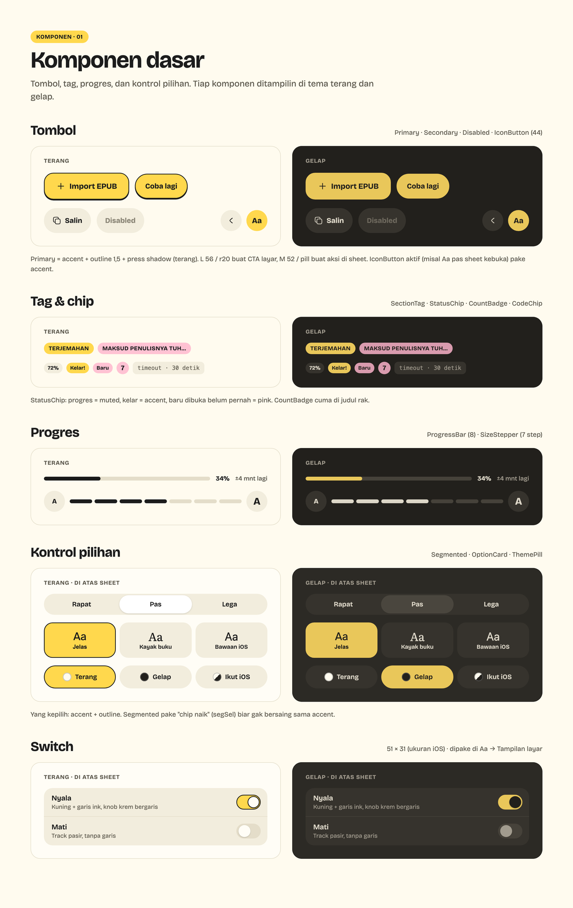

<p align="center">
  <picture>
    <source media="(prefers-color-scheme: dark)" srcset="apps/mobile/assets/brand/logo-lockup-dark.svg">
    
  </picture>
</p>

<p align="center">
  EPUB reader untuk iOS dan Android. Tap satu paragraf, langsung muncul terjemahan Indonesia dan maknanya, tanpa keluar dari halaman baca.
</p>

<div align="center">
<table>
  <tr>
    <td align="center">
    
    </td>
    <td align="center">
    
    </td>
    <td align="center">
    
    </td>
  </tr>
</table>
</div>

## Kenapa ada

Baca buku bahasa Inggris di app Books itu enak, sampai ketemu paragraf yang gak nyantol: select teks, copy, pindah ke app LLM, paste, ketik "artiin dong", baca, balik, cari lagi posisi terakhir. Terjemahannya bagus, tapi alurnya mutus fokus baca tiap beberapa menit.

Luma ngubah alur itu jadi **satu tap**.

## Fitur

- **Tap paragraf → terjemahan + makna.** Seluruh grup paragraf distabilo dan dikirim ke LLM; hasilnya muncul di bottom sheet, ditulis bertahap (streaming).
- **Bedahin.** Masih bingung sama maknanya? Layar sendiri yang ngebedah gagasan jadi beberapa bagian, lengkap dengan sambungan ke bagian lain di buku.
- **Cache hasil AI.** Grup yang udah pernah di-tap gak manggil LLM lagi.
- **Import EPUB.** Parser sendiri (container → OPF → spine → TOC → cover), jalan di isolate. TOC rusak dilewatin, bukan bikin import gagal.
- **Rak buku** dengan cover, progres, dan kartu "Lanjut baca yuk".
- **Halaman baca imersif.** Cuma teks dan garis progres tipis; menu muncul sebagai kapsul ngambang. Pengaturan Aa (font, ukuran, jarak baris, tema terang/gelap).
- **Posisi baca tersimpan** per buku.
- **Backup & restore** semua data ke satu file `.zip`.

Data semuanya lokal di device (SQLite lewat Drift). Satu-satunya yang keluar adalah teks grup yang lagi di-tap, dikirim ke OpenRouter pakai API key milik sendiri.

## Desain

Desain sistemnya namanya **Stabilo**: teks dulu, UI belakangan. Kuning stabilo cuma buat yang lagi penting (satu layar, satu tombol kuning), dan mode gelap pakai hitam hangat, bukan hitam pekat. Semua layar punya versi terang dan gelap.

<table>
  <tr>
    <td align="center">
    <picture>
      <source media="(prefers-color-scheme: dark)" srcset="docs/images/baca-dark.png">
      
    </picture>
    </td>
    <td align="center">
    
    </td>
    <td align="center">
    <picture>
      <source media="(prefers-color-scheme: dark)" srcset="docs/images/aa-dark.png">
      
    </picture>
    </td>
    <td align="center">
    <picture>
      <source media="(prefers-color-scheme: dark)" srcset="docs/images/bedahin-nyambung-dark.png">
      
    </picture>
    </td>
  </tr>
</table>

<details>
<summary>Foundation: warna, tipografi, komponen</summary>





</details>

## Tech stack

| | |
|---|---|
| UI | Flutter (versi dikunci lewat [FVM](https://fvm.app), `.fvmrc`) |
| State | Riverpod 3 |
| Database | Drift |
| Routing | go_router |
| LLM | [OpenRouter](https://openrouter.ai), model bisa diganti dari Pengaturan |
| API key | `flutter_secure_storage` (Keychain di iOS, Keystore di Android), gak ikut backup |
| Model data | freezed |

## Struktur repo

```
apps/mobile/   app Flutter
```

Arsitektur berlapis (UI → data) di `apps/mobile/lib`:

```
data/        database Drift, service (OpenRouter, file, secure storage), repository
domain/      logika pure (grouping, parser) + model immutable
routing/     go_router
ui/          tema Stabilo, widget shared, fitur per folder (views + view_models)
```

## Menjalankan

Butuh Flutter lewat [FVM](https://fvm.app), plus Xcode + iPhone / simulator iOS, dan / atau Android SDK + HP Android (USB debugging nyala).

```bash
make get        # pub get
make gen        # codegen (drift, freezed)
make check      # format, analyze, test
make run        # debug di device / simulator
make run-android # debug di HP Android (f=dev buat Luma Dev)
make help       # daftar semua perintah
```

Buat pakai fitur AI, isi API key OpenRouter di **Pengaturan** (key diawali `sk-or-`).

`make release` dan `make dev` meng-install build release ke iPhone yang tersambung. Ada dua app terpisah (bundle id, data, dan Keychain beda): **Luma** untuk dipakai sehari-hari (`make release`, hanya dari `master`) dan **Luma Dev** untuk nyoba fitur yang belum di-merge (`make dev`).

Android sama: `make dev-android` (Luma Dev, branch apa aja), `make release-android` (Luma, hanya dari `master`), dan `make apk` (APK buat sideload, hanya dari `master`). Android gak punya siklus install ulang 7 hari, tapi update (`install -r`) cuma jalan kalau ditandatangani key yang sama, jadi bikin keystore tetap sekali (di luar repo, jangan di-commit):

```bash
keytool -genkeypair -v -keystore ~/.android/luma-release.jks -alias luma \
  -keyalg RSA -keysize 2048 -validity 10000
```

Lalu bikin `apps/mobile/android/key.properties` (sudah di-gitignore) isinya `storeFile=/Users/<kamu>/.android/luma-release.jks`, `storePassword`, `keyAlias=luma`, `keyPassword`. Tanpa file ini build release jatuh ke debug key (jalan, tapi update di mesin lain minta uninstall dulu). Backup file `.jks` + passwordnya: kalau ilang, update harus uninstall dulu.

### Tes ke OpenRouter beneran (opsional)

Taruh `OPENROUTER_API_KEY=sk-or-...` di `.env` di root repo (sudah di-gitignore), lalu:

```bash
make live              # model default
make live m=<model id> # model lain
```

Tanpa key, tes ini di-skip.

## Status

MVP lagi dikerjakan dan dipakai sendiri buat baca. Rencana berikutnya: Recap bacaan dan import Markdown/PDF.
