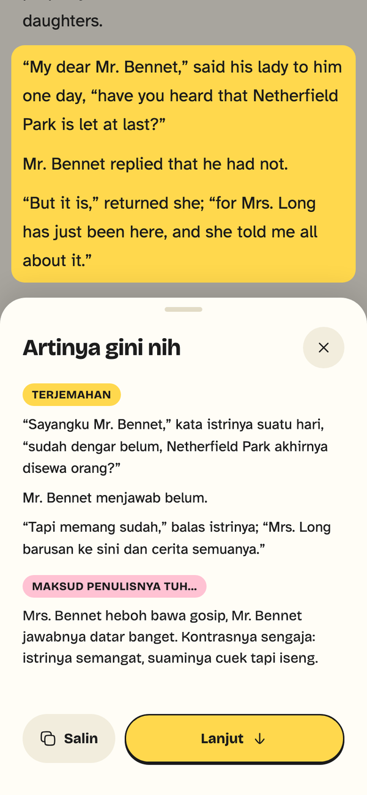
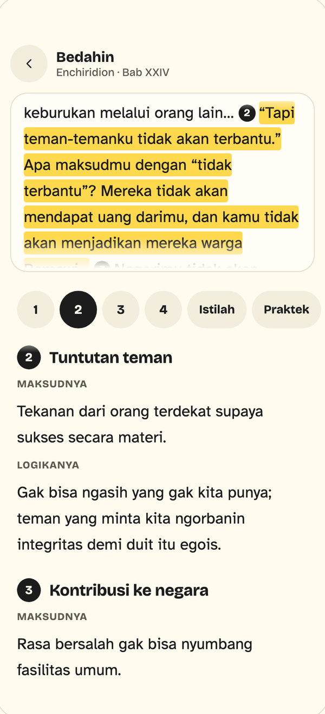

<p align="center">
  <picture>
    <source media="(prefers-color-scheme: dark)" srcset="apps/mobile/assets/brand/logo-lockup-dark.svg">
    
  </picture>
</p>

<p align="center">
  EPUB reader untuk iOS dan Android. Tap satu paragraf, langsung muncul terjemahan Indonesia dan maknanya, tanpa keluar dari halaman baca.
</p>

<div align="center">
<table>
  <tr>
    <td align="center">
    
    </td>
    <td align="center">
    
    </td>
    <td align="center">
    
    </td>
  </tr>
</table>
</div>

## Features

- **Tap paragraf → terjemahan + makna**, ditulis bertahap (streaming) di bottom sheet.
- **Bedahin**: bedah gagasan jadi beberapa bagian, dengan sambungan ke bagian lain di buku.
- **Cache hasil AI**: grup yang pernah di-tap gak manggil LLM lagi.
- **Import EPUB** lewat parser sendiri, jalan di isolate.
- **Rak buku** dengan cover, progres, dan posisi baca per buku.
- **Halaman baca imersif** dengan pengaturan font, ukuran, jarak baris, dan tema terang/gelap.
- **Backup & restore** semua data ke satu file `.zip`.

Data tersimpan lokal (SQLite lewat Drift). Yang keluar dari device hanya teks grup yang di-tap, dikirim ke OpenRouter pakai API key sendiri.

## Tech stack

Flutter ([FVM](https://fvm.app)) · Riverpod 3 · Drift · go_router · freezed · [OpenRouter](https://openrouter.ai) (model bisa diganti di Pengaturan) · `flutter_secure_storage` untuk API key (tidak ikut backup).

## Getting started

Butuh Flutter lewat FVM, plus Xcode (iOS) dan/atau Android SDK.

```bash
make get      # pub get
make gen      # codegen (drift, freezed)
make check    # format, analyze, test
make run      # debug di device / simulator
make help     # semua perintah
```

Isi API key OpenRouter (`sk-or-...`) di **Pengaturan** untuk memakai fitur AI.

Build ke device: `make dev` / `make dev-android` (Luma Dev, branch apa saja), `make release` / `make release-android` / `make apk` (Luma, hanya dari `master`).

Keystore Android (sekali, simpan di luar repo):

```bash
keytool -genkeypair -v -keystore ~/.android/luma-release.jks -alias luma \
  -keyalg RSA -keysize 2048 -validity 10000
```

Lalu buat `apps/mobile/android/key.properties` (gitignored): `storeFile`, `storePassword`, `keyAlias=luma`, `keyPassword`.

## Status

Luma v0.1.0 (Pre-release). Berikutnya: Recap bacaan, import Markdown/PDF.
